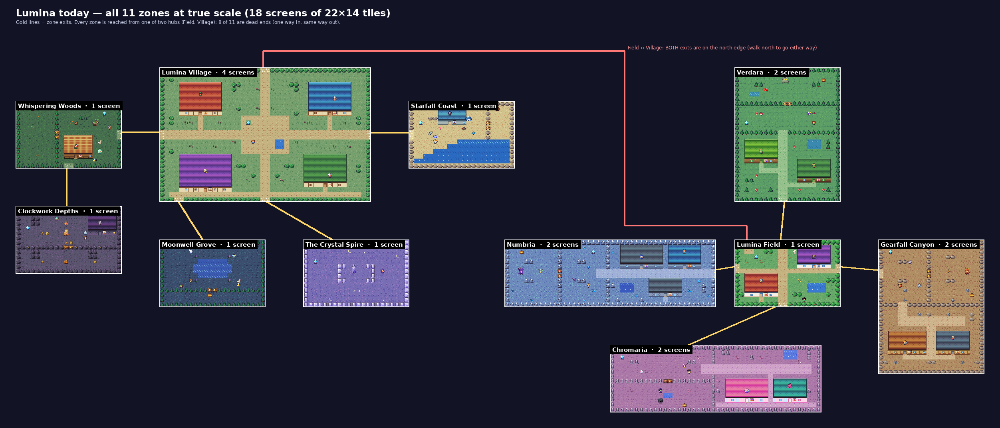

# Hazel Quest — Overworld Roadmap

> From a cluster of screens to a world you can journey across: a Dragon
> Quest 3 / Final Fantasy 2-style overworld where towns, caves, towers and
> shrines are places you walk into, and the map opens up in stages by foot,
> by boat and on Ember's wings.

Status: **proposal, not started** · Date: 2026-10-04

Companion docs: `STORY.md` (Act I bible, tone rules still binding),
`STORY-4X.md` (Acts II–IV content: still the source for every NPC, enemy,
quest and spell), `ROADMAP-4X.md` (its *delivery order* is re-sequenced by §7
here; its content is kept), `DESIGN-JRPG.md` (the kid-design rules: no random
battles, no game over, no reading pressure).

---

## 0. Summary

- **Today the whole world is 18 screens**, arranged as two hubs with spokes.
  Everything is the same scale, so it never feels like a journey.
- **Build a two-scale world:** one big scrolling overworld where each town,
  cave, tower and shrine is an icon you walk into.
- **Shape:** two continents, **Dawnreach** (home) and **Taleshore** (far),
  with the islands of **the Silver Shallows** off home and **the Starfall Sea**
  between them. **Travel ladder:** walk → sail → fly → descend, one new way
  to move per act.
- **The story needs re-staging more than new acts.** The bible already
  describes a bigger world than the maps show. The one new story mechanic: the
  *fog of Forgetting* becomes real fog on the map that lifts as crystals return.
- **First step:** make the renderer handle big maps, then build a 64×48
  vertical slice around Lumina Village.

---

## 1. Where the world is today

### 1.1 Size and shape

*All 11 zones drawn with the game's real tile art at true relative scale
(rendered from `content/zones.ts`). Gold lines are exits; the red line is the
Field ↔ Village link, whose two ends are both north exits (see finding 4).*

| Zone | Size (tiles) | Screens | Ways out | Role |
|---|---|---|---|---|
| Lumina Field | 22×14 | 1 | 5 | hub (Library, Trading Post) |
| Lumina Village | 44×28 | 4 | 5 | second hub, home town (Inn) |
| Numbria / Chromaria | 44×14 | 2 each | 1 | crystal zones |
| Verdara / Gearfall | 22×28 | 2 each | 1 | crystal zones |
| Whispering Woods | 22×14 | 1 | 2 | warden zone (Verdant Key) |
| Starfall Coast / Clockwork Depths | 22×14 | 1 each | 1 | warden zones |
| Moonwell Grove / Crystal Spire | 22×14 | 1 each | 1 | hidden pocket / endgame door |
| **Total** | | **18** | | |

For scale: the world maps in FF1 and FF2 are each 256×256 tiles, before
counting any towns or dungeons.

### 1.2 Why it feels small

1. **Little of it.** 18 screens in all. The 4× plan (`ROADMAP-4X.md`) grows
   this to ~40 zones, but of the same shape.
2. **Hub-and-spoke, not a world.** Every place hangs off Lumina Field or
   Lumina Village, and **8 of 11 zones are dead ends** (one way in, the same
   way out). Nothing is more than three screen changes from the Field
   (Field → Village → Woods → Depths), so there is no travel between places.
3. **One scale only.** Towns, wilderness and dungeons are all the same kind
   of screen. There's no zoomed-out layer where a town is a small icon you
   walk into. That two-scale structure is what makes DQ3 and FF2 feel big.
4. **The geography doesn't add up.** You walk *north* from the Field to reach
   the Village, and *north* from the Village to get back
   (`zones.ts:210` and `:503`). The zones also can't be laid out on one plane:
   the Village would sit on top of Verdara, and Gearfall's south half on top
   of Chromaria. Players can't build a mental map.
5. **Distance doesn't mean danger.** Every enemy's level is the player's
   age-based level plus −1, 0 or +1 (`spawnEnemy` in `enemies.ts`), so far
   places feel the same as near ones.
6. **Every place sounds the same.** Towns, caves and fields share the single
   `overworld` music track (`trackForScreen`, `audio.ts:221`).
7. **One dungeon, special-cased.** The Crystal Spire is the only dungeon, and
   it's bespoke code (`spireStore`, `SpireOverlay`, `floorZone` borrowing the
   `crystal-spire` id), not something other dungeons can reuse.
8. **Nothing to go *into*.** Buildings are roofs that fade in place (#72).
   That's charming and should stay for town buildings, but caves, towers and
   shrines want a "step through the door, new screen" moment.

### 1.3 What already works in our favour

| Already built | Where | What it gives the overworld |
|---|---|---|
| Scrolling camera | `lib/camera.ts` (`camAxis`) | works for any map size |
| Exits with a target + spawn point | `ZoneExit` in `zones.ts` | "step on the cave icon, appear inside" already fits this shape. Only one test (`zones.test.ts:298`, every exit on a map edge) and the slide-only transition block it |
| Gates and key gates | `gateIdAt`, `keyGate`, `KeyGateOverlay` | bridges, mountain passes, fog banks |
| Generated tile art | `tools/assets/tiles.py` | new terrain is code, not hand-drawing |
| Save upgrade ladder | `lib/save.ts` (`MIGRATIONS`) | a safe v2 for vehicle / visited-places state |
| Quest steps + carried items | `content/quests.ts` (`chestStep`, `defeatStep`, `talkStep`, `questItems`) | side quests and fetch chains |
| Multi-floor climb | `content/spire.ts`, `spireStore` | proof that dungeons work; to be generalized |
| Roaming critters + ambient chatter | `lib/wander.ts` | visible overworld monsters |
| Zone invariant tests | `zones.test.ts` (reachability BFS etc.) | extend to "reachable with the travel modes you have" |

### 1.4 The technical risk: per-tile objects

`WorldCanvas.tsx:312-380` creates one KaPlay object per tile, often two (a
ground tile plus an overlay). That's ~300–600 objects for a one-screen zone
and ~1,200–2,500 for the Village. A 160×112 world map would be ~18,000 base
tiles plus overlays, roughly **25,000+ objects updated and drawn every
frame**. Not measured yet, but likely to stutter on the tablets and
Chromebooks this game targets. This must be fixed **before** the map grows
(§5, rank 1).

---

## 2. Do we need multiple continents, islands, and ways to travel?

**Short answer: yes, but small.** Two landmasses, a ring of islands, and
three ways to travel (walk, sail, fly), plus "down" for the finale.

**Why yes:**

- **Vehicles are the cheapest way to make a world feel big.** Each one
  re-opens the map you already know: "I saw that island!" becomes "now I can
  reach it!" Same map, new access, so content goes further.
- **They're the clearest goals a 7–11 year old can hold:** "we need a boat",
  "Ember's almost big enough to carry us".
- **The story already planted them:** Old Marlow's fish "forgot the way
  home" (the sea), Ember grows into a full dragon (flight), Act III crosses
  the Starfall Sea (`STORY-4X.md` §5), and Act IV goes *under* the Spire.

**Why not more:**

- Each continent is a full set of towns, dungeons, NPCs and quests to write
  and test.
- Getting lost is the biggest risk at this age, and more water means more
  empty travel.
- Play sessions are short, so a crossing should take well under a minute.

### 2.1 Recommended shape

| Piece | Size (tiles) | Reached by | Holds |
|---|---|---|---|
| **World map** | ~160 × 112 (~58 screens, about half sea) | — | everything below |
| **Dawnreach** (home continent) | ~80 × 60 | on foot | Act I: Lumina Village, the four crystal regions at the corners, the Spire at the heart, warden areas, Moonwell Grove, 4–6 roadside places |
| **The Silver Shallows** (inner sea) and its islands | 5–7 islands, ~8×8 to 16×12 each | boat | Act II: Eldergrove, the Sunken Archive, one shrine / hermit / treasure per small island |
| **Taleshore** (far continent) | ~56 × 44 | Ember (later also a ferry) | Act III: the ten zones of `STORY-4X.md` §5 |
| **Below the Spire** | dungeon floors | descend | Act IV: the Dream Root |

**Names (decided 2026-10-04).** The whole world is still **Lumina**. Its
parts: **Dawnreach**, the home continent; **Taleshore**, the far continent;
**the Silver Shallows**, the calm inner sea of islands (all shallow water, so
the boat can sail anywhere in it); and **the Starfall Sea**, the open sea
between the continents, where the Great Fogbank sits. Lumina Village and
the other existing place names stay as they are.

Walking speed is 170 px/s (~5 tiles/s), so crossing Dawnreach in a
straight line takes ~16 s, and about 30–45 s along winding roads. That's long
enough to feel like a journey and short enough for a young player.

### 2.2 The travel ladder: one new way to move per act

| Act | Mode | How you get it | What it opens | Speed | Battles |
|---|---|---|---|---|---|
| I | **On foot** | from the start | Dawnreach; bridges and passes opened by gatekeepers and warden keys; fog lifts per crystal | 1× | visible roaming critters |
| II | **Boat** | Old Marlow's boat, repaired in a cross-continent quest (Rivet + Sage Cog) after `spire-cleared` | the Silver Shallows: its coasts and islands; lands only at docks and beaches | 1.5× | visible sea critters |
| III | **Ember (flight)** | Ember full-grown + crystal #5 restored (`flight-unlocked`, `STORY-4X.md` §5) | over mountains, and over the Great Fogbank on the Starfall Sea to Taleshore; sky-only ledges | 2.5× | none (the reward for getting there) |
| IV | **Down** | the Blank Chart (`STORY-4X.md` §6) | the Dream Root beneath the Spire | — | dungeon |

Travel rules (classic, adjusted for kids):

- **The boat waits where you left it**, and the world map always shows where
  that is.
- **Ember lands only on open ground** (grass, sand, roads), never on a town
  or cave icon, so places are still entered on foot.
- **Flying has no battles.** That's the reward for earning it.
- **Rivers and mountains are walls on foot.** Bridges (gatekeeper questions)
  and passes (warden keys) are the doors through them, reusing today's gates.
- **Optional extras only if a region needs one:** a river raft, a mine cart
  in a cave. Not required.

### 2.3 Terrain × travel mode

| Terrain | On foot | Boat | Ember |
|---|---|---|---|
| grass, road, sand, snow | walk | — | fly over, can land |
| forest, hills | walk | — | fly over, can't land |
| mountain | ✗ | ✗ | fly over |
| river | ✗ (bridge) | ✗ | fly over |
| shallow sea | ✗ | sail | fly over |
| dock, beach | walk | board / land | can land |
| fog bank | ✗ until lifted | ✗ until lifted | the Great Fogbank: fly over |
| town / cave / tower / shrine icon | enter | — | — |

### 2.4 Keeping a bigger world kid-friendly

- **Always know where you are.** A world map in the menu (discovered places,
  "you are here", the boat, the current quest's destination). The Spire as a
  landmark you can see from most of the continent. Signposts at crossroads.
- **Always know where to go.** Quest hints name a place. Elder Lumen and
  Grandmother Wick give a "where next?" line keyed to story flags. Every
  town's people point onward (§3.4).
- **Don't walk the same road too often.** A *Return* spell or item that takes
  you to any visited town, early in Act I (DQ's Zoom / Chimaera Wing); flight
  later.
- **No random battles.** Monsters stay visible and avoidable on the overworld
  (`DESIGN-JRPG.md` rule 1).
- **An inn in every town (decided 2026-10-05).** With real travel distance,
  "one inn in the world" (#73, enforced at `zones.test.ts:310`) turns into a
  long walk, so every town gets an inn (different innkeepers, same service).
  Today that means four new inns, in Numbria, Verdara, Gearfall Canyon and
  Chromaria, beside the Sleepy Sheep Inn in Lumina Village. Later towns get
  one too (`STORY-4X.md` already gives the Sunken Archive, Port Lantern and
  Chorus Isle an innkeeper; Remembrance Hill needs one). The test becomes
  "every town has exactly one inn". Unchanged: one Library in the world, and
  "each item is sold in only one shop", which is what makes each town worth
  visiting.
- **Defeat sends you somewhere sensible.** Today losing a battle or the Spire
  climb sends you to `HUB_ZONE` (`BattleArena.tsx:493`,
  `SpireOverlay.tsx:279`). On the overworld it should be the last town you
  rested in.

---

## 3. Does the story need to expand?

**Short answer: some. Mostly connective tissue, not new acts.** The bible
already describes a bigger world than the maps show, and `STORY-4X.md`
already covers three more acts, a sea crossing and a descent. What's missing:
(a) geography the story can point at, (b) a story reason for every barrier,
(c) a handful of travel beats, and (d) the small stories that fill the space
between towns. Estimate: **~15–20 new cutscene panels**, one pass of
"rumor" lines over existing NPCs, and 4–6 small roadside stories per region.
**No new acts.**

### 3.1 The story already describes this world

| The bible says | The maps today | On the overworld |
|---|---|---|
| The Fiends "hid at the corners of the world" (`STORY.md` §1) | the crystal zones are next door to the Field | the four crystal regions sit at the continent's four corners |
| The Spire stands "at the heart of the world" | off the Village's south edge | the Spire stands at the centre, visible from almost everywhere |
| A "fog of Forgetting" covers Lumina | flavour text only | real fog banks on the map, lifted by restoring crystals |
| Old Marlow's fish "forgot the way home" | a joke | the Act II boat quest |
| Ember grows into a dragon | the sprite gets bigger | Ember carries you in Act III |
| Act III crosses the Starfall Sea | planned as a menu screen | sailing, then flying, over a real sea |

### 3.2 The one new story mechanic: fog on the map

The story's central metaphor becomes the progression system. Fog banks cover
parts of the overworld. Restoring a crystal lifts fog in a short scene (the
camera pans to the fog as it peels away). Every crystal then visibly changes
the world, every barrier has a reason, and the world map becomes a picture of
progress. Mechanically it's a gate with a flag, like today's gates.

| Fog | Lifts when | Reveals |
|---|---|---|
| Four small "corner pockets", one near each crystal region | that crystal is restored | a shrine, treasure or side place you could see but not reach (the reward is visible in advance) |
| The ring around the Spire grounds | the first crystal (today's "The Spire wakes" scene, `spire-awake-seen`) | the Spire grounds and Keeper Aurora. The door itself stays sealed until all four crystals, as today |
| The Silver Shallows | `spire-cleared` (Act II opening) | the coastline for the boat, and the islands |
| The road past Moonwell Grove | `act2-seen` | Remembrance Hill (`STORY-4X.md`: "a road that was never there before") |
| The Great Fogbank (on the Starfall Sea) | never on its own. Ember flies over it in Act III; it thins when the Hush Fiend falls | Taleshore by sea (a ferry from Port Lantern) |

### 3.3 New story beats

| Beat | When | Size |
|---|---|---|
| Leaving home | first step out of Lumina Village onto the overworld | 2–3 panels (Wick at the gate, the Spire on the horizon) |
| The fog lifts | each crystal and each act fog | 1 panel + a map pan each (~8) |
| Marlow's boat | Act II opening quest: gather three parts across the continent; Rivet and Sage Cog fix the boat | a quest + ~3 panels |
| First voyage | boarding the boat for the first time | 2 panels |
| The Great Fogbank | first sailing up to it ("even Marlow won't sail into *that*") | 1 panel; sets up flight |
| Ember's first flight | Act III opening | reuse `STORY-4X.md`'s 3-panel flight tutorial |
| Landing on the far shore | Act III | reuse `ACT3_PANELS` |

### 3.4 Writing rules for a bigger world (to add to `STORY.md` §2)

- **Every town points onward.** At least one person per town names another
  place and what's there (a rumor network).
- **Every roadside place is a micro-story:** one character, one riddle or
  trial, one reward, one joke.
- **Every barrier has a reason a kid can say out loud:** "the fog", "the
  bridge is out", "we need a boat", "Ember's too small".
- **Places are named on the world map**, with short names that say what they
  are (keep the Numbria / Gearfall Canyon pattern).

### 3.5 Re-staging Act I (small edits)

- **Settle the hero's home.** `STORY.md` currently says both "a kid from
  Lumina Field" (§1, §3) and "the hero's home, Lumina Village" (§1). On the
  overworld, home is Lumina Village; "Lumina Field" becomes the open country
  around it.
- **Retire Lumina Field as a hub (decided 2026-10-05).** Move Elder Lumen,
  Pip, Maple's Trading Post and the Library into Lumina Village (or a hamlet
  just outside it). The Village becomes `HUB_ZONE` and the hero's home; the
  `lumina-field` zone is removed, and save v2 moves anyone standing in it to
  the Village (§4.5). This happens in Phase 2, when the overworld exists to
  replace the Field as the link between the crystal regions. *Done (item 8,
  2026-10-07): into a new east end of the Village.*
- **Only five lines of game text** mention "Lumina Field", "the field" or "the
  hub" (`story.ts`, `npcs.ts`), so this is cheap to update.
- **The crystal regions move to the corners without redrawing their maps.**
  Their chests, gates and quests keep the same ids, so saves stay valid. Only
  their outer exits change, now leading to the overworld.
- **Act I order stays open, FF1-style.** Numbria is still open first; the
  wardens' keys still gate the other three Fiends.

### 3.6 Acts II–IV placed on the map

| Act | `STORY-4X.md` zone | Where it goes | Reached by |
|---|---|---|---|
| II | Remembrance Hill | Dawnreach, behind the Grove fog | foot |
| II | Eldergrove | a forest island in the Silver Shallows | boat |
| II | Foglight Marsh | a marshy coast across the Silver Shallows | boat |
| II | The Sunken Archive | a half-sunk island ruin in the Silver Shallows | boat |
| III | Port Lantern + 8 island/coast zones | Taleshore | Ember |
| III | Chartmaker's Rest | an island off Taleshore | Ember |
| IV | The Dream Root Door → Nameless Hall | beneath the Spire, at the heart of Dawnreach | down |

The story ends where the map began: back at the Spire, at the heart of home.

---

## 4. Engineering design notes

### 4.1 Zone kinds

Add `ZoneDef.kind: 'overworld' | 'town' | 'field' | 'dungeon' | 'interior'`.
It decides:

- the transition: slide between edge-joined field screens, fade when entering
  a place;
- the default music (add `ZoneDef.music`; Spire floors already carry one);
- whether monsters roam;
- whether the position is saved (dungeon floors don't save mid-floor, as the
  Spire already does).

### 4.2 Places on the overworld

Add `ZoneDef.places?: { id, x, y, icon, to, spawnX, spawnY }[]`, drawn as
one-tile icons that act as exits. Inside a place, its edge exits return to
the overworld cell beside its icon. Relax `zones.test.ts:298` to "edge exits
slide, place entrances fade".

### 4.3 Renderer ✅ (Phase 0, 2026-10-05)

**Built:** instead of one KaPlay object per tile, each cell's frames are
worked out once per zone (`lib/terrain.ts`: `terrainLayers`), and ONE object
draws only the cells in view every frame (`visibleRange`, plus a one-cell
margin). Water animates from the clock (`waterFrame`). Each building's roof
is one object instead of one per roof tile. Props that change on their own
(crystals, chests, gates, Spire seals/stairs/throne) and all characters stay
live objects.

This replaced the earlier "bake 16×16-tile chunks into images" idea: drawing
the visible cells directly needs no async image loading or texture memory,
keeps water animation free, and has the same property that matters — the
per-frame cost depends on the viewport, never on the map size.

Measured with `bench/run-world-bench.cjs` (headless Chromium, software GL):

| Map | Before (1× / 4× CPU throttle) | After (1× / 4×) |
|---|---|---|
| 160×112 | 3.2 / 0.5 fps · 1.4 s load hitch | **60 / 37 fps** · 0.17 s |
| 44×28 (the Village) | 46 / 10.5 fps | 60 / 39 fps |
| 22×14 (one screen) | 60 / 33 fps | 60 / 43 fps |

At 4× the big map is now as fast as a one-screen zone; what's left is the
fixed per-frame cost every zone pays in software-rendered headless Chromium.
All 18 zone screens and 5 Spire floors are pixel-identical to the old
renderer outside animated tiles. Still to do: run the bench on a real
mid-range tablet (TC-326).

### 4.4 Travel modes

Replace `WALKABLE_CHARS` with `passable(tile, mode)`. Add a speed per mode,
board/land rules at docks and open ground, and draw Ember as the mount while
flying.

### 4.5 Save v2

New fields: `vehicle`, `boat: { x, y } | null`, `visited: ZoneId[]` (fast
travel + world map), `lastRest: ZoneId` (where defeat sends you). Use the
existing ladder (`lib/save.ts`): bump `SAVE_VERSION`, add the 1→2 step, add
the stale-client guard that `save.ts` already calls for, and add a test with
a real v1 save. In the same bump:

- drop the unused `sageEquipped` (#53);
- move saves standing in `lumina-field` (and `HUB_ZONE`) to Lumina Village.

Existing zone ids and interior coordinates stay unchanged, so every chest,
gate and quest id in old saves still matches. No Supabase migration is needed
(the save is a JSONB blob).

### 4.6 Map authoring

ASCII maps are fine up to ~64 columns (towns, caves, the vertical slice). The
160×112 world map should be painted in **Tiled** (free map editor) and
imported as JSON, or assembled from smaller ASCII regions. Port the zone
invariant tests to whichever format is chosen.

*Built (2026-10-07):* Dawnreach is a Tiled map (`src/content/maps/dawnreach.tmj`)
painted with a legend tileset whose tiles stand for map characters; the game
reads it back into rows (`tiledRows`), so the invariants needed no porting.
How-to: `docs/MAP-AUTHORING.md`.

### 4.7 Tests to add

- **No softlocks:** for each act, every place the act needs is reachable
  with the travel modes available by then (BFS per mode).
- Every place icon has an inside, and its return exit lands on a walkable
  overworld cell beside the icon.
- Every fog region has a lifting flag that can be earned before the fog is in
  the way.
- Docks touch shallow sea; every region has somewhere Ember can land.
- A performance smoke test: the world map's object count (or build time)
  stays under budget.

---

## 5. Ranked work list

Effort: **S** small · **M** medium · **L** large. Ranked by priority, which
mostly follows build order.

| # | Item | Effort | Phase | Done when |
|---|---|---|---|---|
| 0 | ✅ **Quick fix:** Field ↔ Village exits are both north (`zones.ts:210`, `:503`) | S | 0 | **Done (2026-10-05):** the Field's road to the Village now leaves south and the Village's way back is north; zones.test guards every exit pair |
| 1 | ✅ **Big-map renderer:** one terrain layer drawing only visible cells (§4.3) | M | 0 | **Done (2026-10-05):** a 160×112 map runs as fast as a one-screen zone (60 fps; 37 fps at 4× CPU throttle, was 0.5); existing zones pixel-identical |
| 2 | ✅ **Overworld zone + enterable places** (§4.1–4.2) | L | 1–2 | **Done (2026-10-06, Phase 1):** `dawnreach` with 8 enterable places; you walk out of the Village, enter each place by its icon and come back out beside it; no save change, so old saves load |
| 3 | ✅ **Overworld art:** terrain, structure icons, smooth coast/road edges (#71b), fog tiles, the Spire landmark (`tools/assets/tiles.py`) | M | 1–2 | **Done (2026-10-06):** terrain, icons, fog and the Spire landmark in Phase 1; rounded coasts, beaches and roads (edge blending, `blendLayer`) everywhere but the Spire floors — no square-edged water |
| 4 | ✅ **Transitions + music per place kind** | S | 1 | **Done (2026-10-06, Phase 1):** places fade (slides between neighbouring screens stay), and towns, fields/overworld, caves and shrines each have their own track |
| 5 | ✅ **Map authoring:** Tiled import, invariants ported (§4.6) | S–M | 1→2 | **Done (2026-10-07):** Dawnreach's terrain is painted in Tiled (`content/maps/dawnreach.tmj`) and read back into rows by `tiledRows`, so every zone test runs on it; guide in `docs/MAP-AUTHORING.md` |
| 6 | ✅ **Wayfinding:** world map menu, quest markers, signposts, "where next?" lines | S–M | 2 | **Done (2026-10-07):** the menu map flags the next goal (🚩) with the way there; two crossroads signposts on Dawnreach; Elder Lumen, Grandmother Wick and Scout Tamsin say where to go next — all worked out from the story flags and the maps (`lib/wayfinding.ts`) |
| 7 | ✅ **Fog banks** (§3.2) | S–M | 2 | **Done (2026-10-07):** each crystal lifts its own fog pocket on Dawnreach (a chest on its topic); the first crystal also clears the shrine road and a ring over the Spire grounds; each lift plays on screen once — the camera glides to the fog as it peels away — with a storybook panel |
| 8 | ✅ **Re-stage Act I on Dawnreach** (§3.5) | M (mostly content) | 2 | **Done (2026-10-07):** Dawnreach grew to 80×60 with the four crystal regions at its corners (Numbria NW, Gearfall Canyon NE, Verdara SW, Chromaria SE — each its own icon, its fog pocket beside it); Lumina Field retired, its people and buildings now in Lumina Village (home, `HUB_ZONE`); save v2 moves old saves; Act I walks start to finish as a journey |
| 9 | ✅ **Field spells + shrines:** *Return* (fast travel), *Glow* (light dark caves), *Calm* (critters ignore you), learned at roadside shrines by passing a short question trial; spells unlocked by flags, not just Sages/crystals (`spellsKnown`, `spells.ts:94`) | M | 2 | **Done (2026-10-07):** Wayfarer Juniper (Wayfarer's Shrine) teaches 🏠 Return, Old Wren (Shrine of First Light) 🔆 Glow, Keeper Thistle (Shrine of Quiet Paws) 🕊️ Calm — each by a 3-question trial, learned as a `spell:<id>` flag, cast from the menu (`content/fieldSpells.ts`); the Echo Mine is pitch dark past its first chamber until Glow lights it for good |
| 10 | ✅ **Real dungeons:** generalize the Spire (floors as ordinary zones joined by stairs, optional darkness, treasure, a boss at the bottom). Clockwork Depths first — note ISSUES #78: the candle-light overlay ignores the camera, fix it for dungeons bigger than one screen | M–L | 2 | **Done (2026-10-07):** floors are ordinary zones joined by stairs exits (`>` / `<`), grouped by `content/dungeons.ts`; the Clockwork Depths (entered from Dawnreach since Phase 1) is 3 floors — B1 as before, B2 the dim two-screen Gear Halls with a side hall that needs Glow, B3 the Titan's Forge with the boss and a hoard; darkness follows the camera (#78 fixed in item 9). The Spire numbers its floors and lights them the same way; its trial floors stay its own (ISSUES #103a) |
| 11 | **Inns everywhere, more townsfolk, rumor lines** (§2.4, §3.4) | S | 2 | every town has an inn and ~8–12 people; every town points onward |
| 12 | **Regional difficulty:** keep question level matched to the child, scale enemy HP, damage, behaviours and coins by region | S | 2 | far regions feel tougher without harder questions |
| 13 | **Side-quest item chains:** "have item" / "bring item" steps, key-item chests in dungeons | S–M | 2–3 | e.g. find the Moonstone in a cave and bring it to a hermit |
| 14 | **The boat + islands** (Act II) | M + content | 3 | Marlow's boat quest → sail the Silver Shallows; the Act II zones live on islands and coasts |
| 15 | **Ember flight + Taleshore** (Act III) | M + content | 4 | fly over the Great Fogbank; land, explore, fast-travel |
| 16 | **The Dream Root** (Act IV) on the dungeon engine | M | 5 | descend beneath the Spire; the finale plays as written |

---

## 6. Phases

**Phase 0 — Groundwork.** Decisions (§8), renderer (#1), the north/north fix
(#0), the save v2 design. *Exit:* a big test map runs smoothly; nothing
visible changes for players.
*Status (2026-10-05):* renderer ✅ and north/north fix ✅. The save v2 design
stands as written in §4.5 and ships with the first feature that needs a new
save field (Phase 1/2). Decisions 5–9 in §8 are still open; none blocks
Phase 1. Remaining check: the bench on a real tablet (TC-326).

**Phase 1 — Vertical slice.** A 64×48 overworld around Lumina Village: the
Village, Whispering Woods, the entrance to Clockwork Depths, one shrine, one
fog pocket; fades and music per place kind; a stub world map. *Exit:* a kid
can walk out of the Village, find the Woods, go in, and come back out beside
it, and the world already feels bigger. **This proves the whole pipeline
before any existing content is moved.** Also in Phase 1: the bench cleanup
from the Phase 0 code review (ISSUES #77). Ready for it already: the exit
check (`edgeLinkProblem`) handles towns with several gates onto the
overworld, and culling + camera clamping use `worldView`, so a zoomed-out
camera (decision 6) draws correctly.
*Status (2026-10-06):* built. `dawnreach` is a 64×48 overworld holding all
eight places around the Village (the Village, Lumina Field, the Woods, the
Depths cave, the Grove, the Spire, the Coast and the new Shrine of First
Light). One fog pocket seals the shrine until any crystal is restored. Zone
kinds pick fade vs slide and the music (new town / cave / shrine themes),
and the menu has a stub world map. The bench cleanup (#77) is done.
As built, it differs from §4.1–4.2 in three ways:
- the kinds are `overworld / town / field / dungeon / shrine` (no
  `interior`: building interiors stay inside their town);
- music is per kind (`ZONE_KIND_TRACK`), not a per-zone `music` field;
- places are `PlaceDef` icons on `P` tiles, with the link itself kept in
  `exits` like every other exit.

Follow-ups for Phase 2 are in ISSUES #82.

**Phase 2 — Dawnreach (Act I on the map).** The full continent with
the four crystal regions at the corners and the Spire at the heart; fog that
lifts per crystal; 4–6 roadside places; field spells; Clockwork Depths as the
first real cave; inns everywhere; the rumor pass; regional difficulty. *Exit:*
Act I is playable start to finish as a journey, and old saves load.
*Status (2026-10-07):* items 7 (fog) and 8 (Act I re-staged) done. As built,
Dawnreach is 80×60: the Phase 1 island was kept whole in the middle (shifted
8 right and 6 down) and a lobe of land added at each corner for a crystal
region, so the Village — not the Spire — sits at the heart, with the Spire
just south of it inside its fog ring (moving the Spire would have meant
repainting the whole middle; revisit if the landmark idea needs it, #100g).
Save v2 shipped with it (§4.5): `lumina-field` saves wake in the Village,
Dawnreach positions shift with the map, the pocket chests keep their opened
state, `sageEquipped` is gone, and a client now refuses a save from a newer
version. `visited` / `lastRest` / `vehicle` / `boat` wait for the features
that need them (fast travel, inns everywhere, the boat).
*Item 9 (2026-10-07):* field spells done. As built, `visited` is not a save
field but a `visited:<zone>` flag per place (flags already ride through every
save untouched, so no version bump was needed), and Return flies to the five
towns, landing just inside each one's front door.
*Item 10 (2026-10-07):* real dungeons done — floors are zones, stairs are
exits, so a dungeon needs nothing special from the canvas; the Spire shares
the floor naming and lighting but keeps its trial floors (ISSUES #103).
Next: items 11–13.

**Phase 3 — The sea (Act II).** Marlow's boat, the Silver Shallows and its islands,
the Act II zones from `STORY-4X.md` §4 placed per §3.6.

**Phase 4 — The sky (Act III).** Ember flight over the Great Fogbank, Taleshore
with `STORY-4X.md` §5's zones, sky-only side places.

**Phase 5 — Down (Act IV).** The Dream Root beneath the Spire, on the
generalized dungeon engine.

---

## 7. How this changes `ROADMAP-4X.md`

| 4× wave | Status after this roadmap |
|---|---|
| Wave 0 — Foundations | mostly shipped; its remaining items still apply |
| Wave 1 — Act II (Memory) | **paused (decided 2026-10-05)** until Phase 2 exits; then becomes **Phase 3**, built on the map with the boat. Don't build its four zones as edge-linked screens |
| Wave 2 — Companions, Ember in battle | unchanged; can land any time after Phase 2 |
| Wave 3 — Act III (Starfall Sea) | becomes **Phase 4**; its "world map / fly-travel screen" becomes real flight over a real map |
| Wave 4 — Depth (NG+, side dungeons, daily loop, parent dashboard) | unchanged, except the "mini-Spire" side dungeons become island and roadside dungeons |
| Wave 5 — Act IV (The Name) | becomes **Phase 5** |

`STORY-4X.md` content (cast, enemies, quests, spells, flags) is kept as
written; only *where* each zone sits and *how you get there* changes.

---

## 8. Decisions

Struck-through items are decided; the rest are still open.

1. **World shape.** Approve two continents + islands + walk / sail / fly /
   descend (§2)? *Recommended: yes.*
2. ~~**Names.**~~ **Decided (2026-10-04):** the world stays **Lumina**;
   continents **Dawnreach** (home) and **Taleshore** (far); seas **the Silver
   Shallows** (inner) and **the Starfall Sea** (outer). Still open: region
   names for the world map.
3. ~~**Retire Lumina Field as a hub.**~~ **Decided (2026-10-05): yes.** Its
   people and buildings fold into Lumina Village in Phase 2 (§3.5). *Done
   (item 8, 2026-10-07).*
4. ~~**An inn in every town.**~~ **Decided (2026-10-05): yes**, reversing
   #73's one-inn rule (§2.4).
5. ~~**Visible monsters only, no random battles**, on the overworld too?~~
   **Taken as recommended in Phase 1 (2026-10-06): yes**: Dawnreach's
   critters roam visibly like everywhere else.
6. ~~**Overworld tile scale.**~~ **Taken as recommended in Phase 1: the
   same 32px tiles** as towns (DQ-style). The camera can still zoom out
   later (culling and clamping already handle it).
7. ~~**Map authoring.**~~ **Taken as recommended (2026-10-07): Tiled for
   the world map, ASCII for everything smaller.** Dawnreach moved to Tiled
   first (roadmap item 5), so the full continent is painted there from the
   start. Only the terrain lives in Tiled; places, exits and fog stay typed
   in zones.ts (ISSUES #82g).
8. **When the boat arrives:** Act II as planned, or at the end of Act I so
   islands can hold early side content? *Recommended: Act II.*
9. **Flight timing:** keep `STORY-4X.md`'s rule (Ember flies at crystal #5)?
   *Recommended: yes.*
10. ~~**Pause `ROADMAP-4X.md` Wave 1 (Act II).**~~ **Decided (2026-10-05):
    yes.** No Act II zones get built until Phase 2 (Dawnreach) exits; they
    are then placed on the map per §3.6 (§7).

---

## 9. Risks and guardrails

| Risk | Guardrail |
|---|---|
| Kids get lost | world map with markers, the Spire landmark, signposts, "where next?" lines, rumor rule (§2.4) |
| Backtracking gets tedious | *Return* early in Act I, flight later, inns everywhere, short crossings |
| Stutter on tablets / Chromebooks | renderer first (rank 1); performance smoke test (§4.7) |
| Breaking existing saves | keep zone ids and interior coordinates; save v2 via the ladder with a real-v1 test (§4.5) |
| Softlocks from travel gating | per-act, per-mode reachability tests (§4.7) |
| Scope creep | cap at two continents; one structure per small island; vehicles beyond boat + Ember only if a region needs one |
| Tone drift (barriers feel punishing) | fog is "the world forgetting"; lifting it is always a celebration; barriers never take anything away |
| Building Act II in the old shape | `ROADMAP-4X.md` Wave 1 is paused until Phase 2 exits (decided 2026-10-05, §7) |
